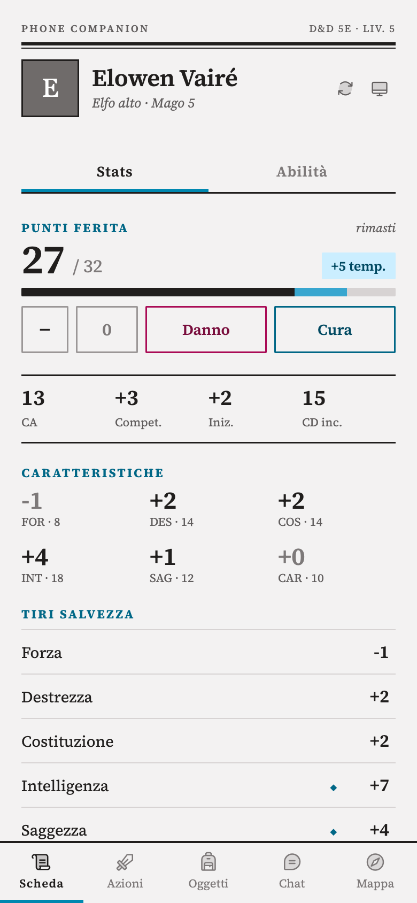
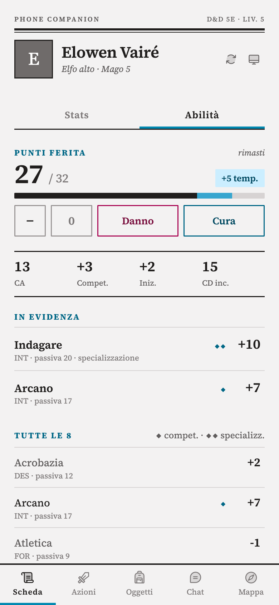
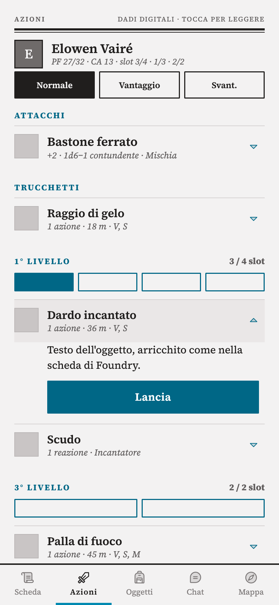
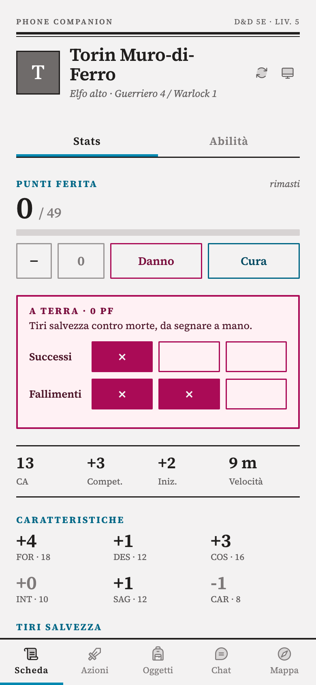
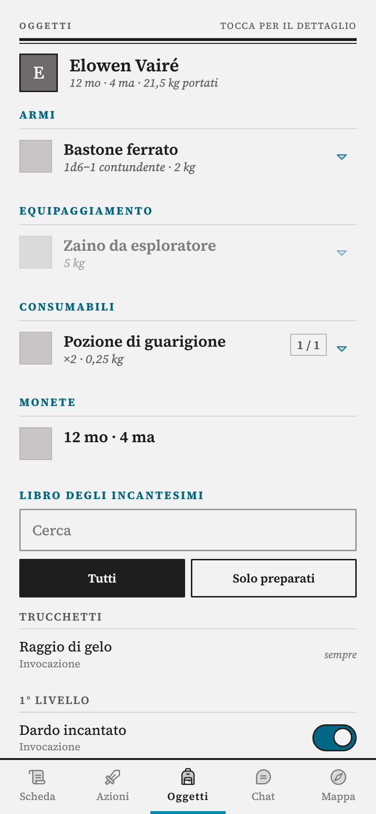
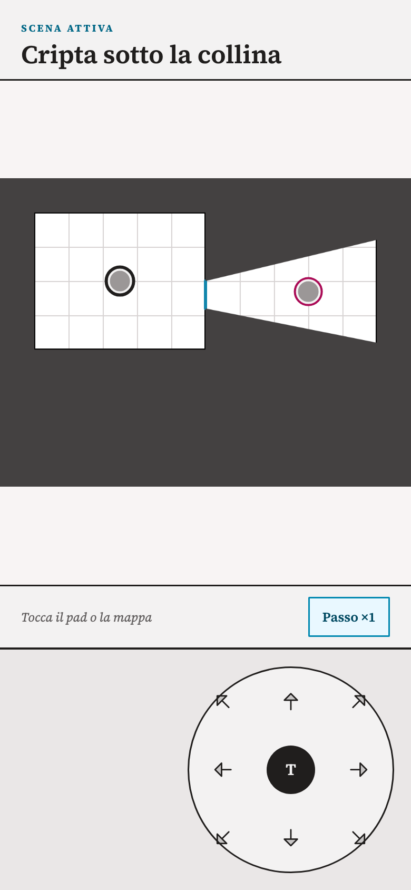
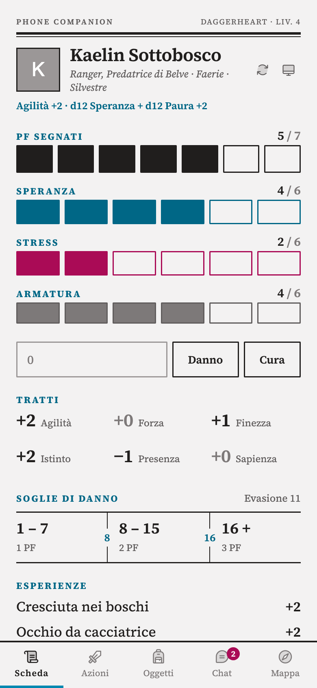
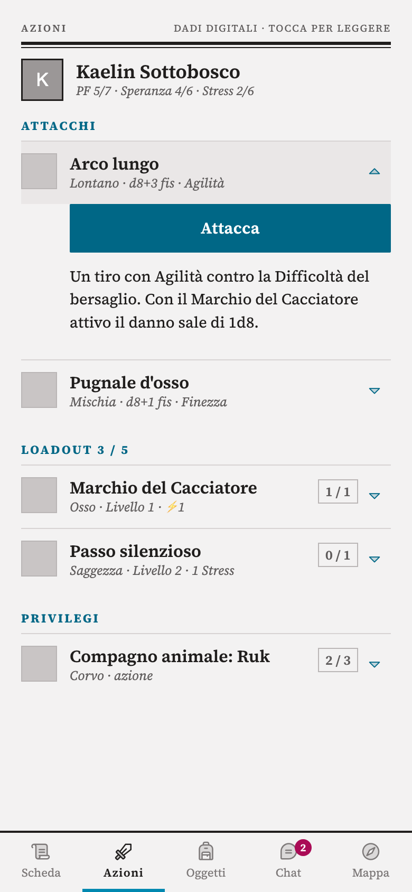
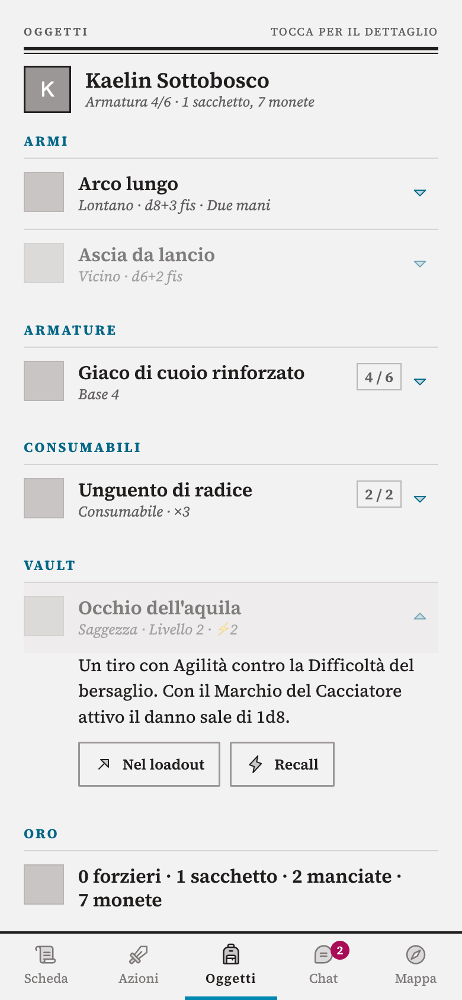
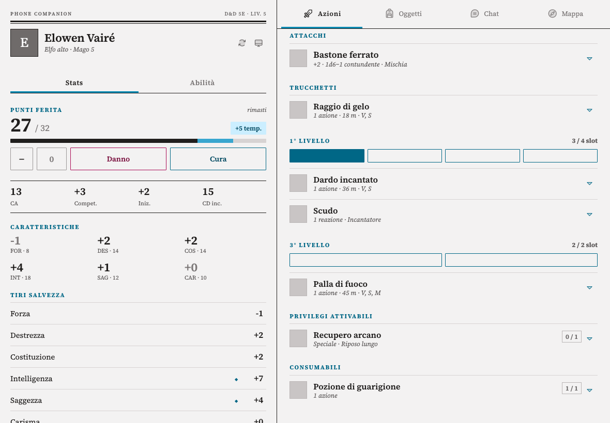

# Phone Companion per Foundry VTT

Interfaccia mobile per giocare **dal vivo, al tavolo, con Foundry sullo schermo del GM**. I giocatori aprono lo stesso mondo dal telefono e trovano, al posto dell'interfaccia standard, una schermata pensata per il touch. Il telefono sostituisce la scheda cartacea e serve a muovere il proprio token; i dadi restano quelli veri, a meno che non si attivino i dadi digitali.

Priorità, in ordine:

1. **Scheda**: punti ferita con danno/cura, caratteristiche, abilità, tiri salvezza (D&D 5e) o tratti, Speranza, Stress, Armatura, soglie di danno (Daggerheart), condizioni, riposi. È il riferimento da tenere sotto mano.
2. **Mappa**: minimappa leggera (senza canvas) con i token e un pad direzionale per muovere il proprio token di una casella alla volta, oppure toccando un punto della minimappa. I movimenti vengono validati dal client del GM, che controlla i muri. Con la **nebbia di guerra** la mappa mostra solo le zone che il gruppo ha esplorato, con i muri disegnati come linee di riferimento.
3. **Azioni** e **Oggetti**: attacchi, incantesimi, carte dominio, privilegi e inventario. Toccando una riga si apre il testo dell'oggetto, per leggere cosa fa. Equipaggia, prepara, sposta nel vault.
4. **Chat**: in secondo piano, per le regole o gli appunti che il GM manda in chat. Con un badge sui messaggi non letti.

Per il GM, lo stesso modulo trasforma il journal in un documento: aprendo una nota si scrive subito, con salvataggio automatico, e dal telefono il companion mostra le note al posto della scheda.

Con **Dadi digitali** attivi (impostazione del dispositivo, spenta di default) toccare caratteristiche, attacchi e incantesimi tira tramite il sistema, con il risultato nella chat di Foundry, e la chat guadagna dadi rapidi e formule libere.

Il modulo non usa un server esterno e nemmeno CDN: gira dentro il normale client Foundry, con font (Cinzel e Montserrat per l'interfaccia, Source Serif 4 per i testi discorsivi, tutti OFL) e icone (Phosphor duotone, MIT) inclusi in `styles/vendor/`. Sul telefono si può disattivare il canvas (il modulo lo propone al primo avvio), così non vengono scaricate le immagini delle scene e il caricamento resta leggero.

## Schermate

| D&D 5e · Scheda | D&D 5e · Abilità | D&D 5e · Azioni (dadi digitali) |
|---|---|---|
|  |  |  |
| **D&D 5e · A 0 PF** | **D&D 5e · Oggetti e libro** | **Mappa · nebbia e muri** |
|  |  |  |
| **Daggerheart · Scheda** | **Daggerheart · Azioni** | **Daggerheart · Oggetti e vault** |
|  |  |  |

**Tablet**: scheda sempre a sinistra, le altre sezioni a destra.



Le schermate usano personaggi di prova.

## Requisiti

- Foundry VTT v14
- Sistema **dnd5e** (provato con la 6.0.3) oppure **daggerheart** (provato con la 2.10.1). Con altri sistemi restano disponibili chat, dadi e mappa.

## Installazione

1. Scarica `module.zip` dalla release.
2. Nella cartella dati di Foundry crea `Data/modules/foundry-companion-local-phone` e scompatta lo zip **dentro** quella cartella (i file dello zip, come `module.json`, devono stare direttamente lì).
3. Riavvia Foundry, poi in ogni mondo dove vuoi usarlo attiva **Phone Companion** da *Gestisci moduli*: il modulo si attiva mondo per mondo.

Se la repo è pubblica si può installare anche da *Moduli aggiuntivi → Installa modulo* con il manifest `https://github.com/vietts/foundry-companion-local-phone/releases/latest/download/module.json`.

## Uso al tavolo

1. Il GM crea un utente Foundry per ogni giocatore e gli assegna il personaggio (proprietà sull'attore).
2. Il telefono apre lo stesso indirizzo che usa il GM: `http://<ip-del-pc>:30000` sulla stessa Wi‑Fi se Foundry gira sul computer del GM, oppure il dominio del server se Foundry è ospitato altrove. Se Foundry gira in Docker, il link "LAN" degli inviti mostra l'indirizzo interno del container e dal telefono non funziona.
3. Il giocatore entra con il suo utente. Su telefono e tablet l'interfaccia companion parte da sola. Sul tablet (da 740 px di larghezza) è su due colonne: la scheda sempre a sinistra, a destra Azioni, Oggetti, Chat o Mappa.
4. Al primo avvio il modulo propone di disattivare il canvas su quel dispositivo: accetta.

Per forzare la modalità da desktop (per esempio per provarla): `Impostazioni → Phone Companion → Modalità companion = Sempre attiva`, oppure aggiungi `?companion=1` all'URL. Dal companion il pulsante con il monitor riporta all'interfaccia Foundry completa.

## Giocare senza internet

Il modulo non ha bisogno di internet, ma i telefoni devono raggiungere Foundry. Se Foundry è ospitato su un server e al tavolo non c'è rete, lo si fa girare sul portatile del GM e i telefoni si collegano lì, su una Wi‑Fi senza internet (hotspot del portatile o router da viaggio). La licenza Foundry permette di usarlo su più macchine, ma non su due nello stesso momento.

`tools/foundry-offline.sh` sposta i dati fra server (Foundry in Docker, raggiungibile via ssh) e Mac:

1. Copia `tools/offline.env.example` in `tools/offline.env` e inserisci host ssh, percorso di `Data/` e nome del container.
2. Prima della sessione, con Foundry chiuso sul portatile: `tools/foundry-offline.sh pull`. Spegne Foundry sul server, fa un backup dei mondi locali e copia mondi, sistemi, moduli e asset. La prima volta ci mette un po', poi copia solo le differenze.
3. Al tavolo apri Foundry sul portatile. I telefoni vanno su `http://<ip-del-portatile>:30000`: lo script stampa l'indirizzo.
4. Dopo la sessione, con Foundry chiuso: `tools/foundry-offline.sh push`. Fa un backup dei mondi sul server, ci ricopia mondi e asset nuovi e riaccende Foundry.

Fra `pull` e `push` Foundry sul server resta spento, così il mondo non viene modificato in due posti. `tools/foundry-offline.sh status` dice dove si sta giocando. Serve la stessa versione di Foundry su server e portatile, e se non coincidono il `pull` avvisa.

## Note del GM

- **Sul portatile** le voci del journal si aprono nel foglio *Documento*: le pagine di testo sono sempre in modifica (niente matita, niente finestra separata) e si salvano da sole un secondo dopo l'ultima modifica; l'indicatore in alto dice se è salvato. "+ Pagina" aggiunge una pagina di testo. Segnaposti sulla mappa, *Jump to Pin*, link e permessi funzionano come prima. Per tornare al foglio di Foundry: *Configura foglio* sulla voce.
- **Dal telefono**, entrando come GM, il companion mostra **Note** e **Chat**: ricerca, recenti, cartelle, e le note si leggono e si scrivono con lo stesso editor. **Appunto** crea al volo una nota nella cartella "Appunti", intitolata con data e ora (la cartella prende il nome nella lingua di Foundry: "Appunti" in italiano, "Inbox" in inglese).
- Se la stessa pagina è aperta su due dispositivi dello stesso utente (per esempio portatile e telefono), quello che scrivi da una parte compare dall'altra appena viene salvato, se lì non stai scrivendo. Lo stesso vale fra utenti diversi (un co-GM): le modifiche compaiono dopo ogni salvataggio, non lettera per lettera.
- Le pagine di testo in Markdown, le immagini, i PDF e i video si leggono come in Foundry.

## Effetti dal telefono

Con il modulo **Tavolo VFX** (`daggerheart-vfx`) attivo, la scheda Azioni mostra in cima una striscia con i token della scena: toccandoli si scelgono i bersagli, che compaiono sullo schermo del GM con il mirino del giocatore. Le azioni che hanno un effetto hanno un ▶: quando il GM dice che è riuscito, lo si tocca e l'effetto parte sullo schermo grande dal token del personaggio verso i bersagli. Senza bersagli partono solo gli effetti che non ne hanno bisogno (ad area o sul personaggio); un dardo o una freccia chiedono di sceglierne uno.

- Il ▶ non consuma slot, Speranza o usi: si segnano come sempre con le caselle della scheda.
- La striscia mostra i token non nascosti, ordinati per distanza (in combattimento prima i combattenti, per iniziativa), con il proprio in fondo. Con la nebbia attiva, solo quelli nelle zone esplorate.
- L'effetto lo gioca il client del GM, che controlla che il giocatore possieda il personaggio: serve un GM connesso con la scena del token aperta. Se il GM è collegato da più dispositivi, risponde quello che ha la scena aperta.
- Senza Tavolo VFX la scheda Azioni resta com'è.

## Impostazioni

Mondo (GM):

- **Token mostrati sulla minimappa**: solo i propri, propri + amichevoli, tutti i non nascosti.
- **Nebbia di guerra sulla mappa del telefono**: attiva di default. La mappa mostra sfondo, muri e token degli altri solo nelle zone esplorate dal gruppo. Le zone le registra il client del GM mentre i token dei giocatori si muovono (linea di vista contro i muri, porte comprese), quindi serve un GM connesso con la scena aperta; l'esplorazione è condivisa dal gruppo e parte da zero. Per azzerarla su una scena, da macro: `game.modules.get("foundry-companion-local-phone").api.resetFog()`.
- **Stile della mappa del telefono**: *Schema* (default: fondo bianco con la griglia della scena e i muri in nero, leggibile su qualsiasi mappa) oppure *Immagine della scena*. I muri disegnati sono solo quelli che bloccano la vista (pieni) o la limitano (terrain, tratteggiati); le porte sono in azzurro, le porte segrete appaiono come muri.
- **Valida i movimenti sul client del GM**: attivo di default. Il telefono invia la richiesta, il client del GM esegue lo spostamento con controllo dei muri. Il controllo funziona solo se il GM sta guardando la scena attiva; se guarda un'altra scena, o se nessun GM è connesso, il token viene mosso senza controllo e il giocatore riceve un avviso.

Dispositivo (ogni giocatore):

- **Modalità companion**: auto / sempre / off.
- **Dadi digitali**: spenti di default. Accesi, le caratteristiche e gli oggetti diventano tirabili.
- **Tiri rapidi**: tira subito con la modalità scelta sul telefono (vantaggio, svantaggio, reazione) senza aprire il dialog del sistema. Disattivala se vuoi il dialog completo (per esempio per lanciare un incantesimo a livello più alto in D&D 5e).
- **Messaggi di chat tenuti sul telefono**.

## Cosa fa per ogni sistema

**D&D 5e**: scheda in due sottoschede. *Stats*: punti ferita con barra e temporanei, CA, competenza, iniziativa e velocità (o CD degli incantesimi per chi li lancia), caratteristiche, tiri salvezza, slot incantesimo e dadi vita a caselle da segnare a mano (slot del patto in ocra), risorse (privilegi con usi limitati), concentrazione con *Interrompi*, privilegi passivi, condizioni con selettore, tiri salvezza contro morte a caselle a 0 PF, riposi. *Abilità*: le abilità migliori in evidenza e tutte le altre con ◆ competenza e ◆◆ specializzazione. Con i dadi spenti, toccare un tiro lo fissa in testata ("Forza · prova d20 +4"); aprire un'azione fissa colpire e danno. Azioni: attacchi, incantesimi per livello con le caselle degli slot, privilegi e consumabili attivabili. Oggetti: equipaggia/togli, danni delle armi, monete e peso, libro degli incantesimi con ricerca, filtro "solo preparati" e interruttori. Danno e cura passano da `applyDamage` del sistema (PF temporanei compresi).

**Daggerheart**: tratti con tiro Speranza/Paura (`rollTrait`), modalità azione/reazione/vantaggio/svantaggio, esperienze selezionabili per il tiro successivo (costano 1 Speranza), contatori Speranza/Stress/Armatura, soglie di danno. Il danno inserito passa da `takeDamage`, quindi applica soglie e slot armatura come dal foglio. Azioni: attacchi con le armi equipaggiate (o disarmato), carte dominio nel loadout, privilegi con azioni. Oggetti: armi e armature con equipaggiamento, consumabili, vault delle carte dominio con recall, oro. Riposi e mossa di morte aprono i dialog del sistema.

## Stato

Versione 0.4.2, provata dal vivo su Foundry 14.367 con dnd5e 6.0.3 e Daggerheart 2.10.1: scheda, azioni, oggetti, chat, movimento sulla mappa, nebbia di guerra e sincronizzazione con la scheda desktop. L'impaginazione a due colonne per tablet (0.2.1) è provata solo in anteprima. Le API usate sono quelle dei sistemi (stessi metodi chiamati dai loro fogli). Le note del GM (0.3.0) sono provate su un Foundry locale; sul telefono vero non ancora. Gli effetti dal telefono (0.4.0) sono provati dal vivo sul server con Tavolo VFX, in D&D 5e e in Daggerheart 2.10.5, con il giocatore in modalità companion senza canvas. Le creature evocate in D&D 5e (0.4.1, per esempio il compagno del Signore delle Bestie) sono provate dal vivo dal telefono. Il gruppo Reazioni e le righe per singola attività (0.4.2, per esempio Protective Field del Psi Warrior) sono provati dal vivo dal telefono.

## Struttura

```
scripts/
  main.mjs              avvio, hook, attivazione della modalità companion
  settings.mjs          impostazioni
  device.mjs            rilevamento telefono/tablet
  socket.mjs            richieste di movimento verso il client GM
  vfx.mjs               ponte opzionale verso daggerheart-vfx (effetti dal telefono)
  movement.mjs          esecuzione dello spostamento e minimappa
  fog.mjs               zone esplorate, registrate dal client del GM
  app/companion-app.mjs interfaccia (ApplicationV2)
  app/targets-data.mjs  ordine e filtri della striscia dei bersagli
  systems/              adattatori: dnd5e, daggerheart, generico
  journal/doc-sheet.mjs   foglio "Documento" del journal
  journal/doc-editor.mjs  editor sempre attivo con salvataggio automatico
  journal/autosave.mjs    salvataggio differito, uno alla volta
  app/gm-notes.mjs        scheda Note del GM nel companion
templates/parts/        template Handlebars per ogni sezione
styles/companion.css
  styles/vendor/        font e icone incluse (licenze accanto ai file)
lang/                   en, it
tests/                  test delle parti pure (node --test)
```

Gli adattatori di sistema espongono la stessa interfaccia (`prepareHeader`, `prepareSheet`, `prepareActions`, `prepareInventory`, `handle`), quindi aggiungere un sistema vuol dire scrivere un file in `scripts/systems/`.

## Licenza

MIT.
